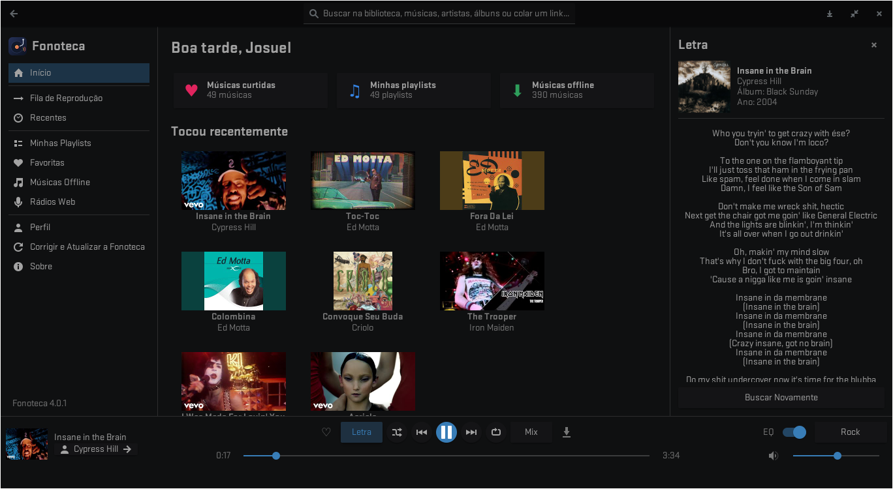
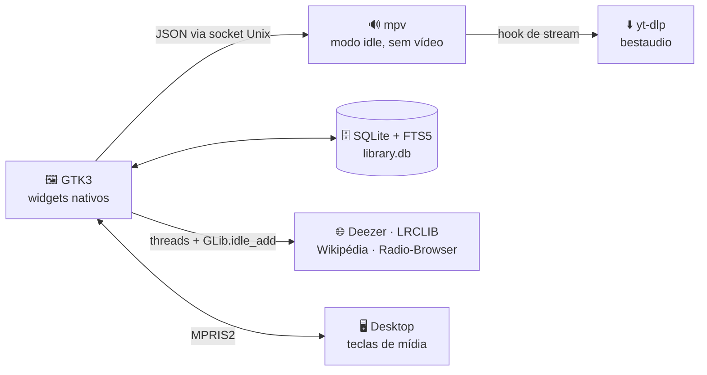

<div align="center">


# Fonoteca

### Uma biblioteca musical para descobrir, organizar e ouvir música.

Player **leve e nativo para Linux** · Python + GTK3 + mpv · sem Electron, sem conta, sem chave de API.

<br>

[](LICENSE)
[](#-instalação)
[](https://www.python.org/)
[](https://www.gtk.org/)
[](https://mpv.io/)

<br>

[**⚡ Instalar**](#-instalação) &nbsp;·&nbsp;
[**🎧 Como usar**](#-como-usar) &nbsp;·&nbsp;
[**🎹 Atalhos**](#-atalhos) &nbsp;·&nbsp;
[**🩺 Problemas?**](#-resolução-de-problemas) &nbsp;·&nbsp;
[**🤝 Contribuir**](#-contribuindo)

<br><br>



</div>

---

## O que faz que a Fonoteca?

Ela junta o melhor de dois mundos: a **sua biblioteca offline** e a **vastidão do streaming**, em um app que abre rápido e respeita o tema do seu desktop.

|   |   |
|---|---|
| 🎵 **Biblioteca híbrida** | Arquivos locais (tags e capas) + milhões de faixas online. Banco **SQLite com FTS5**: a busca na sua biblioteca é instantânea. |
| ⏭️ **Gapless entre faixas** | A próxima faixa é resolvida em segundo plano e encadeada no mpv, sem silêncio entre as músicas. |
| 🎛️ **Equalizador de 10 bandas** | ±12 dB e presets prontos: *Flat, Rock, Pop, Bass Boost, Vocal e Jazz*. Abre com `Ctrl+E`. |
| ♾️ **Mix infinito** | Um clique e a fila se abastece sozinha com faixas parecidas com a que está tocando. |
| 📻 **Rádios web** | Milhares de estações ao vivo via Radio-Browser, por nome, país ou gênero. |
| 🎤 **Letras** | Painel lateral com a letra da faixa (LRCLIB ou a embutida no arquivo). |
| 🧠 **Descoberta** | Biografia (Wikipédia), discografia, faixas populares, artistas parecidos e ranking **Em alta** por país (Deezer). |
| ⬇️ **Downloads em MP3** | Para conteúdo que você tem o direito de baixar, com capa e tags ID3 gravadas. Veja o [aviso legal](#-aviso-legal-e-direitos-autorais). |
| 📊 **Perfil e estatísticas** | Nível, mais ouvidas, horários e últimos 14 dias. Tudo calculado **só no seu computador**. |
| 🖥️ **Integração com o sistema** | **MPRIS2**: teclas de mídia, widget do painel e notificações. |

<details>
<summary><b>🔧 Como ela funciona por dentro</b></summary>

<br>



- **Sem pausa:** faltando ~15 s para o fim, a próxima faixa entra na fila do mpv com `loadfile append`.
- **Metadados limpos:** cada resultado do YouTube é cruzado com o Deezer (título, artista, duração).
- **Gravação segura:** arquivos JSON atômicos (temporário + `os.replace`) e socket em pasta privada `0700`.
- **Privacidade:** nenhuma conta, nenhuma telemetria, nenhuma chave de API.

</details>

---

## ⚡ Instalação

Abra o **Terminal**: pressione <kbd>Ctrl</kbd> + <kbd>Alt</kbd> + <kbd>T</kbd> ou procure por "Terminal" no menu de aplicativos. Depois, copie cada comando abaixo, cole com <kbd>Ctrl</kbd> + <kbd>Shift</kbd> + <kbd>V</kbd> e aperte <kbd>Enter</kbd>.

### 🐧 Ubuntu · Debian · Mint

**1️⃣ Instale `git` e `python3`:**

```bash
sudo apt install git python3
```

**2️⃣ Baixe a Fonoteca e abra o instalador**, depois é só seguir o "avançar, avançar, concluir":

```bash
git clone https://github.com/barbosabrasileiro/fonoteca.git && cd fonoteca && python3 fonoteca-installer.py
```

Pronto! Abra **Fonoteca** no menu de aplicativos. 🎉

<details>
<summary><b>Outras distros</b></summary>

<br>

Troque só o passo 1 e depois use o mesmo comando do passo 2.

**Fedora**
```bash
sudo dnf install git python3
```

**Arch / Manjaro**
```bash
sudo pacman -S git python
```

O instalador também reconhece openSUSE, Void e Alpine.

</details>

> [!TIP]
> O instalador fica no menu como *Instalador da Fonoteca* e na barra lateral do app, em **Corrigir e Atualizar a Fonoteca**.

---

## 🎧 Como usar

<table>
<tr>
<td width="50%" valign="top">

### 🔍 Buscar e tocar
- Digite na busca e aperte `Enter`.
- **Cole um link** (`Ctrl+V` em qualquer lugar do app) para tocar na hora.
- Filtros: *Tudo · Biblioteca · Músicas · Artistas · Álbuns*.
- **Botão direito** em qualquer faixa, álbum ou artista abre o menu completo: fila, mix, playlist e mais.

### ♾️ Mix automático
Toque uma música e clique em **Mix** no player. A fila vira um fluxo sem fim de faixas parecidas.

</td>
<td width="50%" valign="top">

### 📁 Músicas offline
Abra **Músicas Offline**, escolha sua pasta de `.mp3`, `.flac`, `.m4a` e pronto: a Fonoteca indexa as tags e capas. Use **Completar dados online** para preencher o que faltar.

### 🎼 Playlists e favoritas
Curta com `♡` (ou tecla `L`), crie playlists com **+ Playlist** ou salve a fila atual com um clique.

### 💾 Trocando de PC
**Perfil › Exportar perfil** gera um único arquivo com playlists, favoritas e histórico. No outro computador, use **Importar**.

</td>
</tr>
</table>

---

## 🎹 Atalhos

| Tecla | Ação | | Tecla | Ação |
|:---:|---|---|:---:|---|
| <kbd>Espaço</kbd> | Play / Pause | | <kbd>M</kbd> | Mudo |
| <kbd>Ctrl</kbd> + <kbd>→</kbd> | Próxima faixa | | <kbd>L</kbd> | Curtir faixa |
| <kbd>Ctrl</kbd> + <kbd>←</kbd> | Faixa anterior | | <kbd>Ctrl</kbd> + <kbd>F</kbd> | Ir para a busca |
| <kbd>→</kbd> / <kbd>←</kbd> | Avançar / voltar 5 s | | <kbd>Ctrl</kbd> + <kbd>E</kbd> | Equalizador |
| <kbd>Alt</kbd> + <kbd>←</kbd> | Voltar na navegação | | <kbd>Ctrl</kbd> + <kbd>V</kbd> | Colar link e tocar |

Teclas de mídia do teclado e do painel também funcionam, via **MPRIS2**.

---

## 🩺 Resolução de problemas

> [!TIP]
> **Antes de tudo:** abra o instalador e escolha **Diagnosticar** (ou `python3 fonoteca-installer.py --diagnose`). Ele verifica dependências, `yt-dlp` e conexão com os serviços, explica o que está errado e corrige com um clique.

<details>
<summary>🔇 <b>Não toca / "não foi possível reproduzir" / busca vazia</b></summary>

<br>

Quase sempre é o `yt-dlp` desatualizado, porque o YouTube muda com frequência. Atualize:

```bash
yt-dlp -U
# se instalou via pip:
python3 -m pip install -U yt-dlp
# ou deixe o instalador cuidar de tudo:
python3 fonoteca-installer.py --update
```

</details>

<details>
<summary>⚙️ <b>O app não abre ou fecha sozinho</b></summary>

<br>

Rode pelo terminal com registro detalhado e veja a mensagem de erro:

```bash
FONOTECA_DEBUG=1 python3 fonoteca.py
```

Confira também se o `python3-gi` e o `mpv` estão instalados (`mpv --version`).

</details>

<details>
<summary>🔄 <b>Atualizei, mas nada mudou</b></summary>

<br>

Uma Fonoteca que já estava aberta continua rodando o código antigo. **Feche e abra de novo** (o instalador também oferece reiniciar para você).

</details>

<details>
<summary>⬇️ <b>Download não gera MP3</b></summary>

<br>

Falta o `ffmpeg`. Instale com o gerenciador da sua distro (`sudo apt install ffmpeg`, `sudo dnf install ffmpeg-free`, `sudo pacman -S ffmpeg`).

</details>

<details>
<summary>🗂️ <b>Onde ficam meus dados?</b></summary>

<br>

Tudo em `~/.config/fonoteca/`:

| Arquivo | Conteúdo |
|---|---|
| `library.db` | Faixas, playlists, favoritas e histórico (SQLite + FTS5) |
| `config.json` | Volume, janela, equalizador e gapless |
| `queue.json` | Fila de reprodução |
| `stats.json` | Estatísticas do Perfil (só neste computador) |
| `covers/` | Capas extraídas dos arquivos locais |

Se o app vier de uma versão antiga (*YT Music Player*), seus dados são copiados sozinhos na primeira abertura.

</details>

> [!NOTE]
> Não achou a solução? [Abra uma issue](https://github.com/barbosabrasileiro/fonoteca/issues) e rode antes com `FONOTECA_DEBUG=1` para anexar o log.

---

## 🌐 Serviços usados

Nenhum exige chave de API ou login.

[](https://developers.deezer.com/)
[](https://lrclib.net/)
[](https://www.wikipedia.org/)
[](https://www.radio-browser.info/)
[](https://github.com/yt-dlp/yt-dlp)

---

## 📜 Aviso legal e direitos autorais

> [!IMPORTANT]
> A Fonoteca **não hospeda, não distribui e não fornece** músicas, vídeos, letras ou qualquer outro conteúdo protegido. Ela é apenas um player que se conecta a serviços e ferramentas de terceiros (como `yt-dlp`, `mpv`, Deezer, LRCLIB e Radio-Browser), sob o controle e a responsabilidade de quem a usa.

- 🚫 **Este projeto não incentiva, não apoia e não tem como objetivo a pirataria.**
- ⬇️ O recurso de download existe para conteúdo que **você tem o direito de baixar**: obras de sua autoria, em domínio público, com licença que permita (como Creative Commons) ou com autorização de quem detém os direitos.
- 📜 **Você é o único responsável** por respeitar a legislação de direitos autorais do seu país (no Brasil, a Lei nº 9.610/1998) e os termos de uso de cada serviço acessado, inclusive o YouTube.
- 🛠️ Os autores e contribuidores **não se responsabilizam** por qualquer uso indevido do software, conforme a licença GPL-3.0 (sem garantia de qualquer tipo).

Se você é titular de direitos e acredita que algo neste repositório os viola, [abra uma issue](https://github.com/barbosabrasileiro/fonoteca/issues) para que possamos analisar.

---

## 🤝 Contribuindo

Bugs, ideias e *pull requests* são muito bem-vindos!

```bash
git checkout -b feature/minha-ideia
git commit -m "Adiciona minha ideia"
git push origin feature/minha-ideia
```

Depois, abra um **Pull Request**. ⭐ Se a Fonoteca toca no seu coração, deixe uma estrela no repositório.

## 📝 Licença

Software livre sob a **[GNU GPL v3.0 ou posterior](LICENSE)**, sem qualquer garantia.
`mpv` e `yt-dlp` são programas independentes, com licenças próprias. Biografias da Wikipédia sob CC BY-SA 4.0. Este projeto não é afiliado a YouTube, Google, Deezer, Wikimedia ou ao projeto mpv; todas as marcas pertencem aos seus donos. Leia o [aviso legal](#-aviso-legal-e-direitos-autorais) sobre direitos autorais.

<div align="center">

<br>

Feito com ♥ e muita música por [**Josuel Barbosa**](https://github.com/barbosabrasileiro)

</div>
